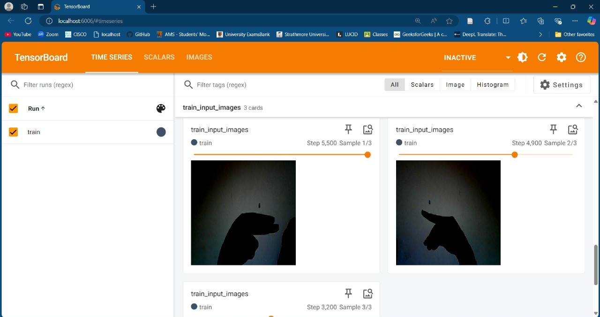

# Savvy Signing

--------------------------------------------------------------------------------------------------------------------------------------------------

# Real-Time Sign Language Gesture Recognition and Translation To Text Web App.

## Description

Savvy Signing will be designed to mainly break the communication barriers between the hearing impaired and those that can hear. This application is designed to recognize the sign language gestures as an individual makes the hand motions and make sense of these hand motions producing actual spoken or written words and sentences that are meaningful. This application will assist individuals who use sign language to effortlessly communicate with anyone from anywhere. 

## Prerequisites

Before deploying Savvy Signing, ensure that the following software is installed on your PC:

##### Congratulations! You have successfully deployed Savvy Signing Application on your PC.

# PROJECT DEFENSE

## Project Overview
The primary objective of this project was to develop a real-time sign language recognition and translation application using cutting-edge machine learning techniques. The system leverages the TensorFlow Object Detection API to detect and classify sign language gestures, translating them into textual outputs to facilitate communication between hearing and non-hearing individuals.

## Motivation & Problem Statement
Sign language is a crucial communication tool for individuals with hearing impairments. However, the lack of widespread understanding of sign language often creates barriers to communication. This project aims to bridge that gap by providing a real-time translation system that can interpret gestures into text. The system has been designed to support not only commonly used sign language gestures (e.g., “Hello,” “Thank You”) but also alphabet letters (A-Z) to allow for greater flexibility and expressiveness.

## Why Tensorflow????
I chose TensorFlow Object Detection API for the following reasons:

- **Ease of Use**: TensorFlow provides an extensive set of pre-built models, allowing rapid prototyping.

- **State-of-the-Art Models**: It includes pre-trained models like SSD MobileNet V2, which are optimized for real-time performance.

- **Flexibility**: TensorFlow’s customizable pipeline configuration allows fine-tuning for specific datasets and tasks.

- **Community and Resources**: TensorFlow’s robust community support and comprehensive documentation made it an ideal choice for implementing this application.

## Data Collection
Since no existing dataset suited the project’s specific requirements, I opted to create my own:

- **Gesture Categories**:
Words: “Hello,” “Yes,” “No,” “Thank You,” “I Love You.”
Alphabet: Letters A-Z.

- **Images**: Captured thousands of images representing each gesture using a webcam setup.
Ensured variation in lighting, hand orientation, and background to improve model generalization.

## Data Annotation 
Annotated the dataset using LabelImg, a user-friendly open-source tool for labeling object bounding boxes:
### Steps:

- Loaded the images.

- Drew bounding boxes around the gestures.

- Assigned labels based on the gesture category (e.g., “Hello,” “a”).

- Saved the annotations in Pascal VOC XML format.

This process ensured accurate localization and labeling, which are critical for effective training.

## Data Augmentation
To enhance the dataset and improve model performance, I applied data augmentation techniques:
- **Random Horizontal Flip**: Simulated mirror gestures.

- **Random Cropping**: Increased robustness to variations in hand positioning.

- **Brightness and Scaling Adjustments**: Improved performance in different lighting conditions.

The augmented images were organized in subdirectories, and their inclusion in the training pipeline was ensured by modifying the TFRecord generation script to handle subdirectories.

## Model Training
Training Pipeline
I fine-tuned a pre-trained SSD MobileNet V2 model:

Configured the pipeline.config file with the following:

- Set num_classes = 31 (for 26 letters + 5 gestures).

- Initialized the model with a fine-tune checkpoint (ssd_mobilenet_v2_fpnlite_320x320_coco17_tpu-8).

- Adjusted the learning rate to avoid catastrophic forgetting:

- Reduced learning_rate_base from 0.08 to 0.008.

- Ensured gradual adaptation to new data while retaining pre-trained knowledge.

- Defined input paths for the train.record and test.record files.

## Monitoring with TensorBoard
During training, I monitored the following metrics using TensorBoard:

- **Loss Curve**: A steady decrease in loss indicated the model was learning effectively.

- **Accuracy**: Improved validation accuracy confirmed the generalization capability of the model.

## Challenges and Solutions
### Class Imbalance:
Observed that the model was biased toward the first five classes (“Hello,” “Yes,” etc.).
Addressed this by augmenting the underrepresented classes (letters A-Z) and balancing the dataset.

### Integration of Augmented Data:
Modified the TFRecord generation script to include images from subdirectories (e.g., /train/augmented).

### Annotation Accuracy:
Verified that annotations matched the labels in the label map to avoid errors during training.

### Overfitting:
Reduced learning rate and applied regularization techniques such as data augmentation to enhance model generalization.

## Results and Performance
The final model achieved:
- High Accuracy on both training and validation datasets.

- Real-time Detection Speed suitable for live applications.

Successful detection of both words and alphabet letters, enabling fluid sign language interpretation.

## Conclusion and Future Work
This project demonstrated the feasibility of using the TensorFlow Object Detection API to create a robust real-time sign language recognition system. In the future, the following enhancements can be made:

- Expand the dataset to include more gestures and variations.

- Implement multi-lingual sign language support.

- Integrate the system with a speech synthesis module for text-to-speech translation.

This project not only bridges communication gaps but also highlights the potential of machine learning in solving real-world problems.

# Acknowledgments
- TensorFlow Object Detection API: [GitHub](https://github.com/tensorflow/models/blob/master/research/object_detection/README.md)
- LabelImg for annotation: [GitHub](https://github.com/HumanSignal/labelImg)